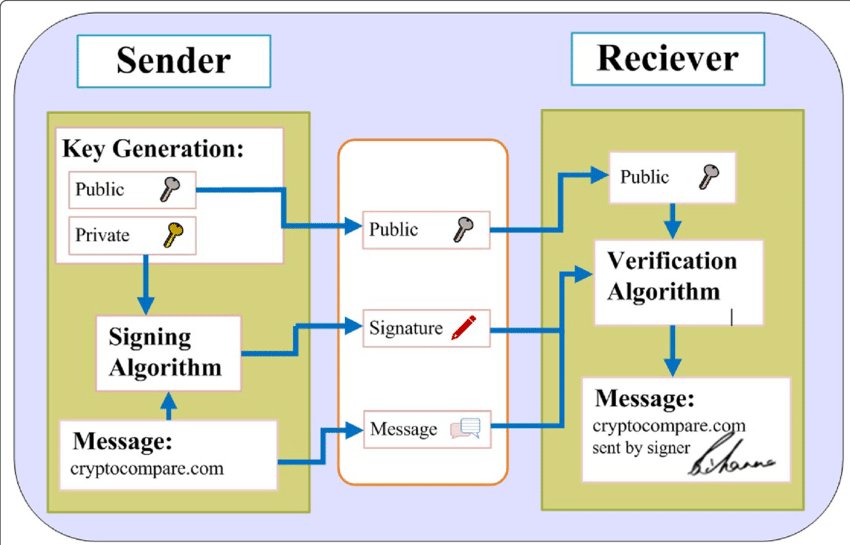

#### HTTP
Messenger between the client and web server

#### HTTPS 
HTTP + SSL
Messenger between client and web server (securely)

### SSL (secure socket layer)

### Definition 
A protocol that enhances secure exchange of data between the client and web server

#### The Why - The internet is insecure
1. Digital Signature
2. Digital Certificate

Client ---> Web Server ---> Client

